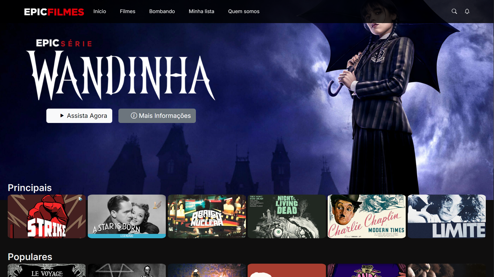

 <h1>Epic Filmes</h1> 
   
> [!NOTE]
> Neste repositório estarão todas as informações sobre o projeto, um projeto criado para a faculdade.

<h3>Programas/Plataformas que utilizei</h3>
<li><a href="https://code.visualstudio.com/">Visual Studio Code</a></li>
<li><a href=https://eclipseide.org/">Eclipse-ide</a></li>
<li><a href="https://www.mysql.com/">MySQL</a></li>
 <li><a href="https://www.w3schools.com/js/">W3schools</a></li>

  
 
> [!TIP]
> **Confira um pouco do desenvolvimento do site: <a href="https://youtu.be/vGRAFcQ60jI?si=vxSREbFA347C1TF1">EpiC Filmes</a>**

> Front-end do **website** desenvolvido inteiramente por mim, com uma breve inspiração na Netflix! <a href="https://www.instagram.com/uguisousa">@uguisousa
</a>

